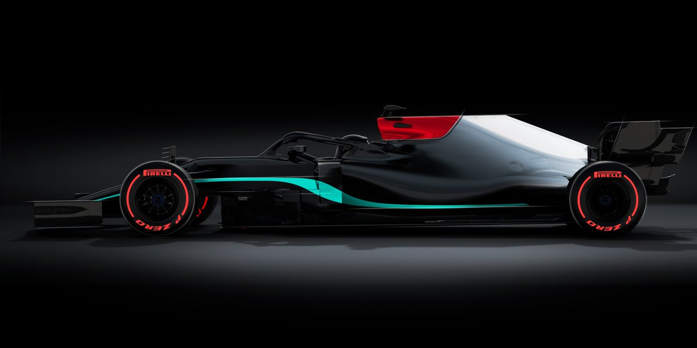

```{r, setup, include = FALSE}
knitr::opts_chunk$set(echo = FALSE, fig.align = 'center')
```

```{r, load-packages, include = FALSE}
# load packages
library(dplyr)
library(plotly)
library(readr)
library(sqldf)
library(knitr)
library(tidyverse)
```


***

## Abstract

> In this report we utilize the World Championship data for formula 1 and use it to answer what has been the driving factor behind the decline of Ferrari's performance in the last decade. We also see how Lewis Hamilton and Sebastian Vettel fare against each other and how the team change they did at the midpoint of their career impacted their performance later on. The last element of our analysis is to put a quantitative lens on Mercedes dominance over its competitors in the past few years. This analysis presumes certain famliarity with the sport 

***

## Introduction

Formula 1 (a.k.a. F1 or Formula One) is the highest class of single-seater auto racing sanctioned by the Fédération Internationale de l'Automobile (FIA) and owned by the Formula One Group. The FIA Formula One World Championship has been one of the premier forms of racing around the world since its inaugural season in 1950. The word "formula" in the name refers to the set of rules to which all participants' cars must conform. A Formula One season consists of a series of races, known as Grands Prix, which take place worldwide on purpose-built circuits and on public roads

***

## Data

The dataset consists of all information on the Formula 1 races, drivers, constructors, qualifying, circuits, lap times, pit stops, championships from 1950 till the latest ended 2020 season. The data is compiled from [The Ergast Developor API](http://ergast.com/mrd/)

```{r data-set-prep, echo=TRUE, message=FALSE, warning=FALSE}

# listing all the csv files in the data directory
file_nm = list.files("archive/")

# Reading all the files in the archive folder:
for(i in seq(1:length(file_nm))){
  str = paste0(file_nm[i],"=","read_csv(",'"','archive/',file_nm[i],'"',")")
  eval(parse(text = str))
  print(file_nm[i])
}

```


***

## Analysis

In this analysis we will primarily be looking at three aspects of the sport which are listed below:

* The fall from grace of Sceuderia Ferrari (The most successfull team in the history of the sport) in the last decade

* Pitch two GOATs of the sport, Lewis Hamilton and Sebastian Vettel against each other and see how they fared against each other

* A look at the Dominance of Mercedes in the Hybrid Era over its competitors

Lets jump right into the analysis

### Why do we care about Ferrari ?


The answer is because Ferrari has been the most successful F1 team by far in terms of number of constructor championship wins. Take a look at the chart below which highlights the number of championships won by different constructors throughout the history of the sport.

```{r champ_count, echo=TRUE, message=FALSE, warning=FALSE}

# Finding out the race id for the last race of each season
# the race id will be used for determining the championship position of each constructor at the end of the season
last_race = races.csv %>% 
  group_by(year) %>% 
  filter(round == max(round)) %>% 
  select(year, raceId) %>% 
  arrange(desc(year), raceId) %>% filter(year < 2021)

# joining the last race data set with the constructor_standings.csv file to get the constructor position at 
# the end of each season. Then filtering for position 1 and aggregating the resultant data set at a constructor
# level to get the number of championships won by them since the beginning of the sport

constructor_champ_count = constructor_standings.csv %>% 
  inner_join(last_race, by = "raceId") %>% 
  filter(position == 1) %>% 
  group_by(constructorId) %>% 
  summarise(championship_wins = n()) %>% 
  arrange(desc(championship_wins)) %>% 
  inner_join(constructors.csv, by = "constructorId") %>%
  select(name, championship_wins) %>% arrange(desc(championship_wins))


constructor_champ_count$name = factor(constructor_champ_count$name, 
                                      levels = unique(constructor_champ_count$name)[order(constructor_champ_count$championship_wins, 
                                                                                          decreasing = TRUE)])

# Making plotly bar chart
fig = plot_ly(constructor_champ_count, 
              x = ~name, 
              y = ~championship_wins,
              text = constructor_champ_count$championship_wins,
              textposition = 'auto',
              type = "bar", 
              name = 'Champ Counts')

# changing axis labels and chart titles
fig = fig %>% layout(yaxis = list(title = 'Championship Count'), 
                     xaxis = list(title = 'Constructor'),
                     title = "Championship Count for each constructor (1950 - 2020)")

# displaying the figure
fig


```

From the graph above we can see that Ferrari is way ahead of other teams with respect to championship counts.

Now lets take a look on who has been winning the championship in the last decade (2010-2019) vs the previous decade (1999 - 2009)

```{r decade_wise_champion, echo=FALSE, message=FALSE, warning=FALSE, results='asis'}

# Let's write a function to find out the championship winning team between any time period. The function will take in the starting
# time period and the ending time period and will return a table with the winning constructor for that year

champion_constructor = function(start_year, end_year){
  last_race_y = races.csv %>% 
    group_by(year) %>% 
    filter(round == max(round)) %>% 
    select(year, raceId) %>% 
    arrange(desc(year), raceId) %>% filter(year <= end_year & year >= start_year)
  
  constructor_standings.csv %>% 
    inner_join(last_race_y, by = "raceId") %>% 
    filter(position == 1) %>% 
    inner_join(constructors.csv, by = "constructorId") %>% 
    select(year, name) %>% rename(`Constructor Champion` = name,
                                  Year = year) %>% arrange(Year)
}

knitr::kable(champion_constructor(2010, 2020), align = 'clc', caption = "Constructor Champions (2010 - 2020)") %>% 
  kableExtra::kable_styling(full_width = FALSE, position = 'float_left',bootstrap_options = "striped")


knitr::kable(champion_constructor(1999, 2009), align = 'clc',caption = "Constructor Champions (1999 - 2009)") %>% 
  kableExtra::kable_styling(full_width = FALSE, position = 'right',bootstrap_options = "striped")

```

From the table above we see that a Champion team like Ferrari has not been able to win even a single championship in the last decade. If they were not able to win a championship then what was their standing in the aforementioned time period.

```{r Ferrari-standing, echo=TRUE, message=FALSE, warning=FALSE}

last_race_info = races.csv %>% 
                  group_by(year) %>% 
                    filter(round == max(round)) %>% 
                      select(year,raceId)

ferrari_standing_ld = constructor_standings.csv %>% 
                        inner_join(last_race_info, by = "raceId") %>% 
                        filter(constructorId == 6 & year >= 2010 & year <= 2020)


fig = plot_ly(
  x = as.factor(ferrari_standing_ld$year),
  y = ferrari_standing_ld$position,
  name = "Ferrari Standings",
  type = "bar"
)


fig = fig %>% layout(title = "Ferrari's Constructor Standings",
                     xaxis = list(title = "Championship Year"),
                     yaxis = list(title = "Championship Position"))

fig


```


* We can see that their constructor standing has not been that bad. Barring a couple of years i.e. __2014 and 2020__ Ferrari has been able to finish in the top 3 spots for the constructor championship

Next lets look at the point deficit between Ferrari and the championship winning team for that particular year. We will be using the following formula for calculating the points deficit:

`Points Deficit = (Points Scored by the Championship winnning team in a year - Points Scored by Ferrari in the same year) `
`/ Points Scored by the Championship winnning team in a year`


```{r Ferrari-Points_Deficit, echo=TRUE, message=FALSE, warning=FALSE}

champion_points = constructor_standings.csv %>% 
      inner_join(last_race_info, by = "raceId") %>% 
        filter(year >= 2010 & year <= 2020 & position == 1) %>% select(year, points)

colnames(champion_points) = c("Year", "Champion Team Points")

Ferrari_points = constructor_standings.csv %>% 
  inner_join(last_race_info, by = "raceId") %>% 
  filter(year >= 2010 & year <= 2020 & constructorId == 6) %>% select(year, points)

colnames(Ferrari_points) = c("Year", "Ferrari Points")

deficit  = champion_points %>% 
              inner_join(Ferrari_points, by = "Year") %>% 
                mutate(`Points Deficit` = ((`Champion Team Points` - `Ferrari Points`)/`Champion Team Points`)*100)


fig = plot_ly(
  x = as.factor(deficit$Year),
  y = deficit$`Points Deficit`,
  name = "Points Deficit",
  type = "scatter",
  mode = 'lines'
)


fig = fig %>% layout(title = "YoY Points Deficit Of Ferrari",
                     xaxis = list(title = "Championship Year"),
                     yaxis = list(title = "Points Deficit (%)"))

fig


```

* Overlaying the points deficit information with constructor standings we see that they had 2 bad seasons early in the decade i.e. __2011 and 2014__. 
* From 2014 onwards the Hybrid Era Began and after some initial hiccups they were able to build a very competitive car the closing the points deficit with Mercedes to a minimum of ~12%

* After 2018 we see the points deficit shoot up to a huge 77% owing to the engine restrictions placed on them by the FIA


Lets now compare Ferrari's performance with the championship winning team in terms of points scored over the course of the season

```{r points-scored, echo=TRUE, message=FALSE, warning=FALSE}

# Subsetting the data for Ferrari and Championship winning team from 2010 - 2020
ferr_vs_champ = 
constructor_standings.csv %>% 
  inner_join(races.csv, by = "raceId") %>% 
  select(constructorId, year, round, points) %>% 
  arrange(year, round, constructorId, points) %>% filter(year >= 2010 & 
                                                           year <= 2020 &
                                                           (constructorId  == 6 | 
                                                              constructorId  == 9 | 
                                                              constructorId  == 131))
# Ferrari and Red Bull
cham_2010_2013 = ferr_vs_champ %>% 
  filter(year >= 2010 & year <= 2013 & (constructorId  == 6 | constructorId  == 9)) %>% 
  pivot_wider(names_from = constructorId, values_from = points)

colnames(cham_2010_2013) = c("year","round","Ferrari","Champion Team")

# Ferrari and Mercedes
cham_2014_2020 = ferr_vs_champ %>% 
  filter(year >= 2014 & year <= 2020 & (constructorId  == 131 | constructorId  == 9)) %>% 
  pivot_wider(names_from = constructorId, values_from = points)

colnames(cham_2014_2020) = c("year","round","Ferrari","Champion Team")

# Appending the two data sets created above
champ_vs_ferr = rbind(cham_2010_2013, cham_2014_2020)

# Writing a function to generate the line plot for a particular year
points_plot = function(year_n){
  
  if(year_n %in% c(2010, 2011, 2012, 2013)){
    
    fig = plot_ly(champ_vs_ferr %>% filter(year == year_n), 
                  x = ~round, 
                  y = ~Ferrari,
                  name = 'Ferrari', 
                  type = 'scatter', 
                  mode = 'lines',
                  line = list(color = "#eb4034"))
    
    fig = fig %>% add_trace(y = ~`Champion Team`, 
                            name = 'Red Bull',
                            line = list(color = "#5f4db8"))
    
    chart_title = paste0("Ferrari vs Redbull (", as.character(year_n),")")
    
  }else{
    
    fig = plot_ly(champ_vs_ferr %>% filter(year == year_n), 
                  x = ~round, 
                  y = ~Ferrari,
                  name = 'Ferrari', 
                  type = 'scatter', 
                  mode = 'lines',
                  line = list(color = "#eb4034"))
    
    fig = fig %>% add_trace(y = ~`Champion Team`, 
                            name = 'Mercedes',
                            line = list(color = "#36b1b5"))
    
    chart_title = paste0("Ferrari vs Mercedes (", as.character(year_n),")")
    
  }
  
  
  fig = fig %>% layout(xaxis = list(title = 'Race Number'),
                       yaxis = list(title = 'Points'),
                       annotations = list(text = chart_title, 
                                          showarrow = F,
                                          x = 10 , 
                                          y = 800),
                       showlegend = FALSE)
  
  return(fig)
}

# Creating an empty list
fin_plot = list()

# Dumping the plots for each year in a list
i = 1
for(year in seq(from = 2010, to = 2020)){
  fin_plot[[i]] = points_plot(year)
  i = i+1
}


# Using the plot list with the subplot command and setting its dimensions
fig_f = subplot(fin_plot, nrows = 5)
fig_f = fig_f %>% layout(width = 800, height = 500)


fig_f


```


__Key Findings:__

* In the __2010 and 2012__ season Ferrari lost the lead early into the championship and was not able to close the gap from there on

* That said they built a very competitive car in __2010, 2012, 2017 and 2018__. Out of all the years in 2010 - 2020 these are the years where Ferrari came closest to winning the championship

* Year __2014, 2019 and 2020__ are actual nightmares


Next lets look at the __race outcomes(DNFs)__ for Ferrari in two separate time periods, namely _2010 - 2014_ and _2015 - 2020_ w.r.t to the championship leaders 

```{r dnfs, echo=TRUE, message=FALSE, warning=FALSE}


dnf_func = function(year_start, year_end, constructor1, constructor2){
  
  df = results.csv %>% 
    inner_join(status.csv, by = "statusId") %>% 
    filter(constructorId  == constructor1 | constructorId  == constructor2) %>% 
    inner_join(races.csv, by = "raceId") %>% 
    filter(year >= year_start & year <= year_end)
  
  if(constructor2 == 9){
    
    dnf_df = sqldf("
    select constructor,
          FinishType,
          count(*) as dnf_count
    from
    (
    select constructor,
      case when ResultType like 'Accident' then 'Accident DNF'
      else 'Non Accident DNF' end as FinishType
      from
      (
            select constructorId,
            case when status like 'Finish%' or status like '+%' then 'Completed'
            else status end as ResultType,
            case when constructorId == 6 then 'Ferrari'
            else 'Red Bull' end as constructor
            from df
            where ResultType <> 'Completed'
      )
    )
    group by constructor,FinishType 
      ")
    
    chart_title = "DNF Ferrari vs Redbull (2010 - 2013)"
  }else{
    
    dnf_df = sqldf("
    select constructor,
          FinishType,
          count(*) as dnf_count
    from
    (
    select constructor,
      case when ResultType like 'Accident' then 'Accident DNF'
      else 'Non Accident DNF' end as FinishType
      from
      (
            select constructorId,
            case when status like 'Finish%' or status like '+%' then 'Completed'
            else status end as ResultType,
            case when constructorId == 6 then 'Ferrari'
            else 'Mercedes' end as constructor
            from df
            where ResultType <> 'Completed'
      )
    )
    group by constructor,FinishType 
      ")
    
    chart_title = "DNF Ferrari vs Mercedes (2014 - 2020)"
    
  }
  
  dnf_df = dnf_df %>% pivot_wider(names_from = FinishType, values_from = dnf_count)
  
  fig = plot_ly(dnf_df, x = ~constructor, y = ~`Accident DNF`, type = 'bar', name = 'Accident DNF')
  fig = fig %>% add_trace(y = ~`Non Accident DNF`, name = 'Non Accident DNF')
  fig = fig %>% layout(yaxis = list(title = 'DNF Count'), 
                       barmode = 'stack',
                       title = chart_title)
  
  return(fig)
  
}


dnf_func(2010, 2013, 6, 9) 
dnf_func(2014, 2020, 6, 131)

```

__Key Findings:__

* From the plot above we see that Ferrari had more DNFs in __2014-2020__ than in the period __2010-2013__
* We can also see a significant degree of rise in Non Accident DNFs in the period of __2014-2020__
* In the __2014-2020__ period number of Non Accident DNFs has jumped from 9 to 34

In racing there are several critical factors like _Optimum Tire Strategy_, _Cars Overtaking Ability_, _Spontaneous Pit Stop Decisions_, _Cars overtaking ability_ etc. Unfortunately we don't have information for that so we would be using a Proxy.

The proxy metric is:

* `Percent Podium Gain = # Number of Podium Finishes when the starting position of the race was out of podium / # Race Starts which was out of podium`

Lets look at the __No Podium Starts__ and __% Podium Gains__ for Ferrari and the Championship winning team for that particular year

```{r percent-podium,echo=TRUE, message=FALSE, warning=FALSE}

races = races.csv
constructor_standings = constructor_standings.csv
constructors=constructors.csv
results = results.csv


season_winner = champion_constructor(2010, 2020)
colnames(season_winner) = c("Year","Constructor_Champion")

podium_gain = sqldf("
                    select races.year,
                           constructors.name,
                           sum(case when results.grid > 3 and results.position < 4 then 1 else 0 end) as PodiumGain,
                           sum(case when results.grid > 3 then 1 else 0 end) as NoPodiumStart
                    from results
                    
                    join constructors
                    on constructors.constructorId = results.constructorId
                    
                    join races
                    on races.raceId = results.raceId
                    
                    join season_winner
                    on season_winner.year = races.year
                    
                    where (races.year between 2010 and 2020) and constructors.name in ('Ferrari', season_winner.Constructor_Champion)
                    
                    group by races.year, constructors.name
      
                  ")

podium_gain = podium_gain %>% mutate(name = case_when(
                                     name == "Ferrari" ~ "Ferrari",
                                     name == "Red Bull" ~ "Champion Team",
                                     name == "Mercedes" ~ "Champion Team"
))

podium_gain$percent_podium = podium_gain$PodiumGain / podium_gain$NoPodiumStart

perc_pod_df =  podium_gain %>% 
              select(year, name, percent_podium) %>% 
              pivot_wider(names_from = name, values_from = percent_podium)


no_pod_df = podium_gain %>% 
  select(year, name, NoPodiumStart) %>% 
  pivot_wider(names_from = name, values_from = NoPodiumStart)


fig = plot_ly(perc_pod_df, 
              x = ~year, 
              y = ~Ferrari,
              name = 'Ferrari', 
              type = 'scatter', 
              mode = 'lines',
              line = list(color = "#eb4034"))

fig = fig %>% add_trace(y = ~`Champion Team`,
                        name = 'Champion Team',
                        line = list(color = "#36b1b5"))

fig = fig %>% layout(title = "% Podium Gain (Ferrari vs Champion Team)",
                     xaxis = list(title = "Year"),
                     yaxis = list(title = "% Podium Gain"))
fig


fig = plot_ly(no_pod_df, 
              x = ~year, 
              y = ~Ferrari,
              name = 'Ferrari', 
              type = 'scatter', 
              mode = 'lines',
              line = list(color = "#eb4034"))

fig = fig %>% add_trace(y = ~`Champion Team`,
                        name = 'Champion Team',
                        line = list(color = "#36b1b5"))

fig = fig %>% layout(title = "No Podium Start (Ferrari vs Champion Team)",
                     xaxis = list(title = "Year"),
                     yaxis = list(title = "No Podium Starts"))
fig


```


The above plots tries to grasp team's ability to finish in the podium spots when the qualifying results are not in the top 3. Key Highlights from two graphs above:

* First plot highlights the Ferrari's best of the decade years, 2012 and 2018, where the percentages of the podium finish gains after starting 4 or more on the grid positions are above 0.3

* The second plot undoubtedly concludes that Ferrari, never in the last decade has less "out of podium race starts" than the championship winning teams for respective years


### Driver Analysis of Sebastian Vettel and Lewis Hamilton (two GOATs of the sport)


Next we will analyze the career stats of Lewis Hamilton and Sebastian Vettel from 2010 - 2020. The reason we are looking at these two pilots is because both of them have dominated the sport in the last decade. __Vettel__ bagged all the Championships from __2010 - 2013__ and __Hamilton__ Bagged every championship from __2014 - 2020__ (with the exception of 2016 title which was clinched by Hamilton's team mate Nico Rosberg). Let's look at the overall victories for both the drivers.

```{r Ham-Vet-vic, echo=TRUE, message=FALSE, warning=FALSE}

races = races.csv
status = status.csv

# Filtering data for Hamilton and Vettel
drivers = drivers.csv %>% filter(code == "HAM" | code == "VET")
results = results.csv %>% filter((driverId == 1 | driverId == 20) & position == "1") 
constructors = constructors.csv

# Creating a data set for year wise cumulative victories
df_victories = results.csv %>% 
                filter((driverId == 1 | driverId == 20) & position == "1") %>% 
                inner_join(races.csv, by = "raceId") %>% 
                inner_join(drivers.csv, by = "driverId")%>% 
                select(driverRef, year, raceId, position) %>% 
                arrange(driverRef, year) %>% 
                group_by(driverRef) %>% 
                mutate(Victories = cumsum(position)) %>% 
                group_by(driverRef, year) %>% 
  summarize(tot_vic = max(Victories)) 


# Looking at the Victories volume for Both Vettel and Hamilton
fig = df_victories %>% group_by(driverRef) %>% summarise(victories = max(tot_vic))  %>% 
  plot_ly(x = ~driverRef ,
          y = ~victories,
          text = ~driverRef,
          type = 'bar') %>% 
  layout(xaxis = list(title = "Driver"),
         title = "Hamilton vs Vettel",
         yaxis = list(title = "Victories"))


fig


```

* We can clearly see that both Hamilton and Vettel have a significant number of wins under their belt. That said Hamilton surpasses Vettel in terms of number of victories because of his sheer dominance in the hybrid era

Next we should look at the year - wise split of victories for both the drivers and see how each of them perform YoY.

```{r ham-vet-yoy, echo=TRUE, message=FALSE, warning=FALSE}

vict_ts = df_victories %>% 
            pivot_wider(names_from = driverRef, values_from = tot_vic) %>% 
            fill(vettel, .direction = "down") %>% replace_na(list(hamilton = 0, vettel = 0))


fig = plot_ly(vict_ts, 
              x = ~year, 
              y = ~hamilton,
              name = 'Hamilton', 
              type = 'scatter', 
              mode = 'lines',
              line = list(color = "#eb4034"))

fig = fig %>% add_trace(y = ~vettel,
                        name = 'Vettel',
                        line = list(color = "#36b1b5"))

fig = fig %>% layout(title = "Victories (Hamilton vs Vettel)",
                     xaxis = list(title = "Year"),
                     yaxis = list(title = "Victory Count"))
fig

```

__Key Highlights__:

* From the plot above we see that Hamilton started his career earlier than Vettel (2007 vs 2008)
* Hamilton had 4 victories in his rookie season as compared to 1 victory to Vettel
* Vettel quickly closed the gap between him and Hamilton and surpassed him in terms of overall victories in 2011
* Hamilton turned the tables again when he surpassed Vettel's victories in 2015
* We see a sharp increase in Hamilton's victory count after 2013 (Triggered by his move to Mercedes, the most dominant team in the Hybrid Era)


In terms of victories Hamilton seems to supersede Vettel. Lets look at the overall victories and Pole positions won for both Vettel and Hamilton across teams

```{r poles, echo=TRUE, message=FALSE, warning=FALSE}

vet_poles = results.csv %>% 
  filter(driverId == 20) %>% 
  inner_join(races.csv, by = 'raceId') %>% 
  select(driverId,constructorId, date, grid) %>% 
  arrange(driverId, date) %>% 
  filter(grid == 1) %>% 
  group_by(driverId) %>% 
  mutate(poles = cumsum(grid)) %>% 
  inner_join(constructors.csv, by = "constructorId") %>% 
  select(driverId, date, poles , name) %>% inner_join(drivers.csv, by = "driverId") %>% 
  select(driverId, date,poles, name, surname)

ham_poles = results.csv %>% 
  filter(driverId == 1) %>% 
  inner_join(races.csv, by = 'raceId') %>% 
  select(driverId,constructorId, date, grid) %>% 
  arrange(driverId, date) %>% 
  filter(grid == 1) %>% 
  group_by(driverId) %>% 
  mutate(poles = cumsum(grid)) %>% 
  inner_join(constructors.csv, by = "constructorId") %>% 
  select(driverId, date, poles , name) %>% inner_join(drivers.csv, by = "driverId") %>% 
  select(driverId, date,poles, name, surname)


poles_plot = function(df, constructor1 = 'McLaren', constructor2 = 'Mercedes'){
  
  
  const1 = df %>% filter(name == constructor1)
  const2 = df %>% filter(name == constructor2)
  
  fig_poles = plot_ly(x = ~const1$date, 
                      y = ~const1$poles, 
                      type = 'scatter', 
                      mode = 'lines', 
                      fill = 'tozeroy',
                      name = constructor1)
  
  fig_poles = fig_poles %>% add_trace(x = ~const2$date, 
                                      y = ~const2$poles, 
                                      name = constructor2, 
                                      fill = 'tozeroy')
  if(constructor1 == 'McLaren'){
    chart_title = 'Career Poles (Hamilton)'
  }else{
    chart_title = 'Career Poles (Vettel)'
  }
  
  fig_poles = fig_poles %>% layout(xaxis = list(title = 'Date'),
                                   yaxis = list(title = 'Poles', range = c(0,100)),
                                   title = chart_title)
  
  fig_poles
}

poles_plot(ham_poles, 'McLaren','Mercedes')
poles_plot(vet_poles, 'Red Bull','Ferrari')


```

__Key Highlights__:

* From the plot above we see that the rise in the number of poles that Hamilton secured post his move to Mercedes has skyrocketed

* The same cannot be said about Vettel who saw a much better stint in securing pole positions while he was with Red Bull

* Vettel's pole postion growth has been very flat at Ferrari. Also notice the significant gap between 2013 and 2015 when Vettel was not able to secure even a single pole position

Next let's look at the Victories of the two drivers across teams.

```{r vict-teams, echo=TRUE, message=FALSE, warning=FALSE}

ham_wins =   results.csv %>% 
  filter(driverId == 1 & position == "1") %>% 
  inner_join(races.csv, by = "raceId") %>% 
  inner_join(drivers.csv, by = "driverId") %>% 
  select(driverId,constructorId, date, position) %>% 
  mutate(position = as.numeric(position)) %>% arrange(driverId, date) %>% 
  filter(position == 1) %>% group_by(driverId) %>% mutate(Wins = cumsum(position)) %>% 
  inner_join(constructors.csv, by = "constructorId") %>% 
  select(driverId, date, Wins , name) %>% inner_join(drivers.csv, by = "driverId") %>% 
  select(driverId, date,Wins, name, surname)

vettel_wins = results.csv %>% 
  filter(driverId == 20 & position == "1") %>% 
  inner_join(races.csv, by = "raceId") %>% 
  inner_join(drivers.csv, by = "driverId") %>% 
  select(driverId,constructorId, date, position) %>% 
  mutate(position = as.numeric(position)) %>% arrange(driverId, date) %>% 
  filter(position == 1) %>% group_by(driverId) %>% mutate(Wins = cumsum(position)) %>% 
  inner_join(constructors.csv, by = "constructorId") %>% 
  select(driverId, date, Wins , name) %>% inner_join(drivers.csv, by = "driverId") %>% 
  select(driverId, date,Wins, name, surname)


vict_plot = function(df, constructor1 = 'McLaren', constructor2 = 'Mercedes'){
  
  const1 = df %>% filter(name == constructor1)
  const2 = df %>% filter(name == constructor2)
  
  fig_poles = plot_ly(x = ~const1$date, 
                      y = ~const1$Wins, 
                      type = 'scatter', 
                      mode = 'lines', 
                      fill = 'tozeroy',
                      name = constructor1)
  
  fig_poles = fig_poles %>% add_trace(x = ~const2$date, 
                                      y = ~const2$Wins, 
                                      name = constructor2, 
                                      fill = 'tozeroy')
  chart_title = ''
  if(constructor1 == 'McLaren'){
    chart_title = 'Career Victories (Hamilton)'
  }else{
    chart_title = 'Career Victories (Vettel)'
  }
  
  
  fig_poles = fig_poles %>% layout(xaxis = list(title = 'Date'),
                                   yaxis = list(title = 'Victories', range = c(0,100)),
                                   title = chart_title)
  return(fig_poles)
}

vict_plot(ham_wins)
vict_plot(vettel_wins, 'Red Bull', 'Ferrari')


```

__Key Highlights__:

* The victories plot follows a similar trend to pole position chart

* We see that Hamilton's Victories count skyrocketed after his move to Mercedes where as Vettels Victory growth has been quite flat

* In terms of sheer performance, Vettel's stint at Red Bull was phenomenal where he won 4 world championships

### Era of Mercedes Dominance




Ever since the advent of the Hybrid Era (i.e. 2014 - Present), Mercedes AMG Petronas has been the most dominant team on the Grid clinching 7 consecutive constructor championships. In the following visuals we will compare the performance of Mercedes with its two closes rivals Ferrari and Red Bull and we will see how far has Mercedes been ahead of its competition in the Hybrid Era. Since the 2021 season is still happening we will be using the race data from 2014 - 2020.

Lets start by looking at the number of races won by the three teams since 2014

```{r tot-win-cons, echo=TRUE, message=FALSE, warning=FALSE}


races = results.csv %>% 
        filter(constructorId == 6 | constructorId == 9 | constructorId == 131) %>% 
        inner_join(races.csv, by = "raceId") %>%
        filter(year >= 2014 & year <= 2020) %>%
        filter(position == "1") %>% 
        group_by(constructorId) %>% summarise(n = n()) %>% 
        inner_join(constructors.csv, by = "constructorId")
  
fig = plot_ly(
  x = races$name,
  y = races$n,
  type = "bar"
)

fig = fig %>% 
  layout(title = "Total Wins(2014-2020)",
         xaxis = list(title = "Constructor"),
         yaxis = list(title = "Win Count"))

fig  

```

__Key Highlights__:

* The dominance of Mercedes is evident from their win volumes against their competitor

* The volume of Mercedes wins is nearly 5 times of their nearest competitor

Next let's compare the year over year victories and pole positions for Mercedes, Ferrari and Red Bull and see how they fared against each other in the Hybrid Era

```{r poles-const, echo=TRUE, message=FALSE, warning=FALSE}

poles = 
results.csv %>% 
  filter(constructorId == 6 | constructorId == 9 | constructorId == 131) %>% 
  inner_join(races.csv, by = "raceId") %>%
  filter(year >= 2014 & year <= 2020 & grid == 1) %>% 
  select(constructorId, raceId, date, grid) %>% 
  group_by(constructorId) %>% mutate(poles = cumsum(grid)) %>%
  ungroup() %>% 
  inner_join(constructors.csv, by = "constructorId") %>% 
  select(date, name, poles) %>% 
  pivot_wider(names_from = name, values_from = poles)


poles = poles %>% fill(Mercedes, .direction = "down")
poles = poles %>% fill(Ferrari, .direction = "down")
poles = poles %>% fill(`Red Bull`, .direction = "down")
poles = poles %>% replace_na(list(Ferrari = 0, `Red Bull` = 0))


fig = plot_ly(poles, 
               x = ~date, 
               y = ~Mercedes, 
               name = 'Mercedes', 
               type = 'scatter', 
               mode = 'none', 
               stackgroup = 'one', 
               fillcolor = '#32b8c9')

fig = fig %>% add_trace(y = ~Ferrari, name = 'Ferrari', fillcolor = '#c93237')
fig = fig %>% add_trace(y = ~`Red Bull`, name = 'Red Bull', fillcolor = '#4432c9')
fig = fig %>% layout(title = "Pole Positions (2014 - 2020)",
                     xaxis = list(title = "Year"),
                     yaxis = list(title = "Poles Count"))

fig

```


```{r wins-const, echo=TRUE, message=FALSE, warning=FALSE}

wins = 
results.csv %>% 
  filter(constructorId == 6 | constructorId == 9 | constructorId == 131) %>% 
  inner_join(races.csv, by = "raceId") %>%
  filter(year >= 2014 & year <= 2020 & position == "1") %>%
  mutate(position = as.numeric(position)) %>% 
  select(constructorId, raceId, date, position) %>% 
  group_by(constructorId) %>% mutate(wins = cumsum(position)) %>%
  ungroup() %>% 
  inner_join(constructors.csv, by = "constructorId") %>% 
  select(date, name, wins) %>% 
  pivot_wider(names_from = name, values_from = wins)


wins = wins %>% fill(Mercedes, .direction = "down")
wins = wins %>% fill(Ferrari, .direction = "down")
wins = wins %>% fill(`Red Bull`, .direction = "down")
wins = wins %>% replace_na(list(Ferrari = 0, `Red Bull` = 0))


fig = plot_ly(wins, 
               x = ~date, 
               y = ~Mercedes, 
               name = 'Mercedes', 
               type = 'scatter', 
               mode = 'none', 
               stackgroup = 'one', 
               fillcolor = '#32b8c9')

fig = fig %>% add_trace(y = ~Ferrari, name = 'Ferrari', fillcolor = '#c93237')
fig = fig %>% add_trace(y = ~`Red Bull`, name = 'Red Bull', fillcolor = '#4432c9')
fig = fig %>% layout(title = "Wins (2014 - 2020)",
                     xaxis = list(title = "Year"),
                     yaxis = list(title = "Wins Count"))

fig

```

__Key Highlights__:

* Mercedes has dominated across the board over its competitors in the Hybrid Era

* Although Mercedes has been dominant with respect to clinching poles, Redbull has been able to convert non pole starts to wins in the later half of the era

* This shows that Redbull's stature as a potential threat to Mercedes Dominance has been growing in the recent years 


***


***

## Appendix

Place potential additional information here.
